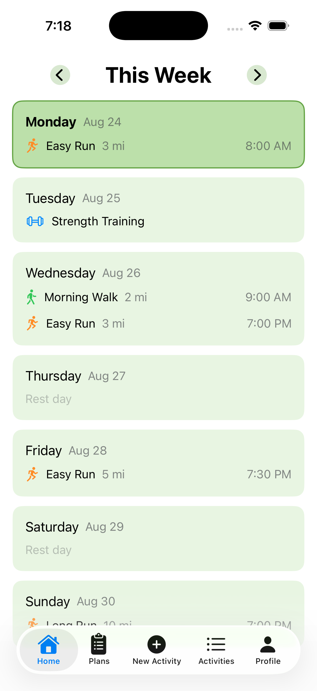
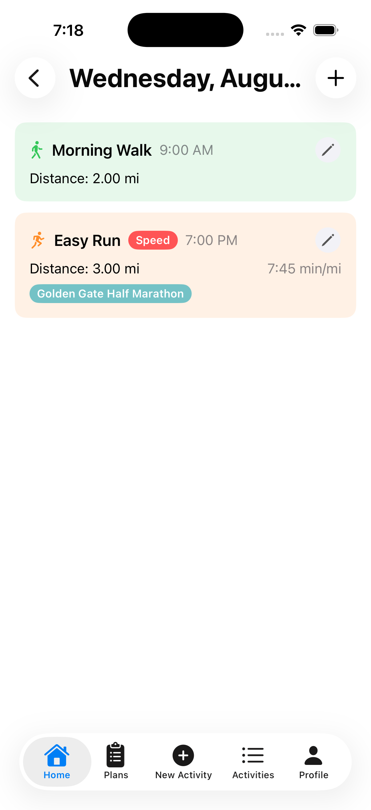
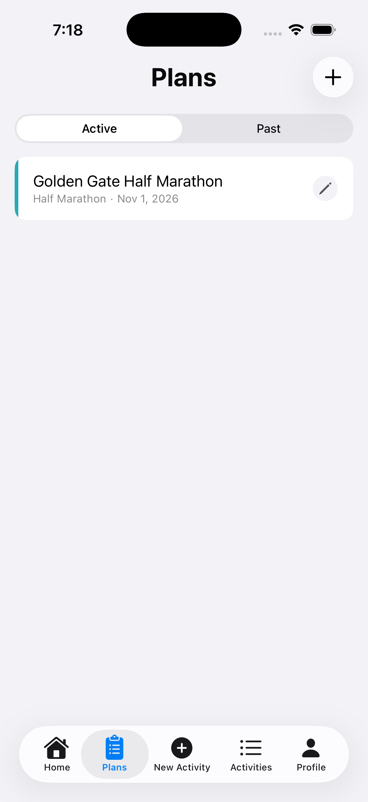
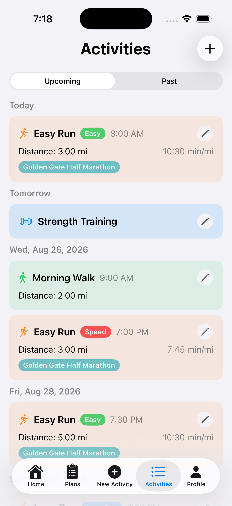

# Running Training Planner

An iOS app for planning and logging running training, backed by a REST API built from scratch. The main view is a weekly calendar where users can plan workouts day by day, with support for training plans tied to a specific race.

---

## Screenshots

| Home | Day View | Plans | Activities |
|------|----------|-------|------------|
|  |  |  |  |

---

## Features

- **Weekly calendar** — page through weeks; each day shows its scheduled activities
- **Training plans** — set a race distance (5K → Marathon), race date, and goal time; activities link back to a plan
- **Activity logging** — log runs, strength training, walks, rock climbs, and more with distance, pace, and notes
- **Pace tagging** — tag runs as Easy, Long Run, or Speed against personal pace targets stored in your profile

---

## Tech Stack

### iOS
| | |
|---|---|
| Language | Swift |
| UI | SwiftUI |
| Auth | Firebase Auth + Google Sign-In |
| Networking | `async`/`await` with `URLSession` |

### Backend
| | |
|---|---|
| Language | Python |
| Framework | FastAPI |
| Database | PostgreSQL (via `asyncpg`) |
| Auth | Firebase Admin SDK (token verification) |
| Package manager | `uv` |
| API hosting | Render |
| Database hosting | Supabase |
